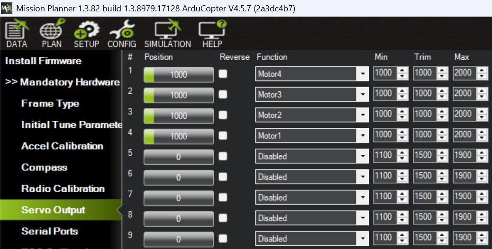

# Cara Setup Urutan Motor #

Salah satu kesulitan dalam melakukan konfigurasi Ardupilot adalah setting urutan dan arah putaran motor. Berikut adalah catatan saya tentang metode yang mudah dalam melakukan konfigurasi ini. Prosedur ini merupakan adaptasi dari [tutorial di forum Ardupilot](https://discuss.ardupilot.org/t/my-method-for-iteratively-configuring-motor-ordering-and-direction/67644)

Untuk menentukan urutan motor, terlebih dulu kita harus memberitahu Ardupilot tentang konfigurasi drone kita. Untuk quadcopter (4 lengan dengan 4 motor di tiap lengan) yang biasa kita pakai di Betaflight, ada banyak sekali frame type yang bisa kita gunakan. Daftar lengkapnya bisa dibaca di [dokumentasi Ardupilot](https://ardupilot.org/copter/docs/connect-escs-and-motors.html#motor-order-diagrams).

Ada beberapa jenis frame yang bentuknya sama, tapi urutan motornya berbeda, misalnya `Quad X`, `Quad X Dji`, `Quad X Clockwise` dan `Quad X Betaflight`.

Ada juga yang urutan motornya sama, tapi arah putarannya berbeda, misalnya `Quad X Betaflight` dan `Quad X Betaflight Reversed`.

Kita harus teliti dalam melihat:

1. Huruf A, B, C, D yang menunjukkan posisi motor
2. Nomor 1, 2, 3, 4 yang menunjukkan penomoran motor
3. Arah putaran baling-baling, CW artinya clockwise (searah jarum jam), CCW artinya counter clockwise (berlawanan arah jarum jam)

Kita bebas memilih frame type yang mana saja, yang penting kita ingat-ingat huruf, angka, dan arahnya. Ini nanti harus disesuaikan dengan wiring antara FC, ESC, dan motor.

## Setting Frame Type ##

Saya biasanya menggunakan arah putaran prop out, sehingga saya memilih frame type `Quad X BF Reversed`. Dengan melihat gambar di atas, maka kita bisa menentukan bagaimana Ardupilot memberi nomer dan posisi pada masing-masing motor, yaitu sebagai berikut:

Quad Frame Type : QuadX Reversed

* A (Kanan Depan) : Motor 2
* B (Kanan Belakang) : Motor 1 
* C (Kiri Belakang) : Motor 3
* D (Kiri Depan) : Motor 4

Frame type disetting pada parameter `FRAME_TYPE` dengan isi `18` untuk jenis `BetaFlightXReversed`.

## Motor Test ##

Pada kondisi sekarang, konfigurasi kita yang terpasang bisa jadi benar, bisa jadi salah. Kalau langsung benar (posisi ABCD sesuai dengan motor yang berputar), alhamdulillah. Berarti sudah selesai. Bisa lanjut ke bagian setting arah putaran motor. Tapi biasanya belum benar. Mari kita jalankan motor test 

**Untuk langkah berikut, PASTIKAN BALING-BALING TIDAK TERPASANG !!!**

Pasang baterai. Bila quad Anda menggunakan VTX, sebaiknya jangan dihubungkan dulu dengan FC, supaya tidak overheat.

**Sekali lagi, PASTIKAN BALING-BALING TIDAK TERPASANG !!!**

Buka menu Motor Test di `Setup > Optional Hardware > Motor Test`

**Jangan lupa, PASTIKAN BALING-BALING TIDAK TERPASANG !!!**

Klik tombol `Test Motor A`, `Test Motor B`, `Test Motor C`, `Test Motor D` secara bergantian. Kemudian catat hasilnya.   

Berikut hasil motor test saya

| Posisi yang dipencet | Motor yang berputar |
|----------------------|---------------------|
| A                    | kiri belakang       |
| B                    | kiri depan          |
| C                    | kanan depan         |
| D                    | kanan belakang      |

Nah, hasil ini belum sesuai dengan yang seharusnya untuk konfigurasi frame `Betaflight X Reversed` yang kita pilih tadi. Tidak masalah. Ini akan kita perbaiki.

Ardupilot akan menyuruh FC -> ESC untuk memutar motor sesuai dokumentasi. Artinya pada waktu kita klik `Test Motor A`, dia akan memerintahkan `Motor 2` yang seharusnya ada di posisi kanan depan (A) untuk berputar. Tapi yang berputar malah kiri belakang, yaitu posisi `C`, yang seharusnya ditempati `Motor 3`.

Supaya lebih jelas, kita tampilkan lagi posisi motor untuk frame `Betaflight X Reversed` sesuai dokumentasi Ardupilot di atas, yaitu sebagai berikut

| Nomor Motor | Posisi Motor   |
|-------------|----------------|
| 1           | kanan belakang |
| 2           | kanan depan    |
| 3           | kiri belakang  |
| 4           | kiri depan     |

Sekarang, isikan nomor motor sesuai motor yang berputar, seperti ini

| Posisi dipencet | Motor berputar | Nomor motor di docs |
|-----------------|----------------|---------------------|
| A               | kiri belakang  | Motor 3             |
| B               | kiri depan     | Motor 4             |
| C               | kanan depan    | Motor 2             |
| D               | kanan belakang | Motor 1             |

Selanjutnya, kita buka konfigurasi servo kita saat ini. Kita akan melihat konfigurasi pasangan nomor servo dan nomor motor.

Buka tab `Setup > Mandatory Hardware > Servo Output`
Konfig yang saat ini terpasang adalah:

* Servo 1 : Motor 1
* Servo 2 : Motor 2
* Servo 3 : Motor 3
* Servo 4 : Motor 4

Kita isikan nomor servo sesuai dengan nomor motor yang diputarnya

| Posisi dipencet | Motor berputar | Nomor motor di docs | Nomor servo di parameter |
|-----------------|----------------|---------------------|--------------------------|
| A               | kiri belakang  | Motor 3             | Servo 3                  |
| B               | kiri depan     | Motor 4             | Servo 4                  |
| C               | kanan depan    | Motor 2             | Servo 2                  |
| D               | kanan belakang | Motor 1             | Servo 1                  |

Urutan motor yang benar, sesuai frame type seharusnya seperti ini:

* A (Kanan Depan) : Motor 2
* B (Kanan Belakang) : Motor 1 
* C (Kiri Belakang) : Motor 3
* D (Kiri Depan) : Motor 4

Sekarang kita tambahkan satu kolom lagi, yaitu nomor motor yang harusnya diputar (sesuai frame type)

| Posisi dipencet | Motor berputar | Nomor motor di docs | Nomor servo di parameter | Nomor motor yang seharusnya berputar |
|-----------------|----------------|---------------------|--------------------------|--------------------------------------|
| A               | kiri belakang  | Motor 3             | Servo 3                  | Motor 2                              |
| B               | kiri depan     | Motor 4             | Servo 4                  | Motor 1                              |
| C               | kanan depan    | Motor 2             | Servo 2                  | Motor 3                              |
| D               | kanan belakang | Motor 1             | Servo 1                  | Motor 4                              |

Dari tabel di atas, kita bisa memperbaiki konfigurasi kita menjadi seperti ini (diurutkan sesuai nomor servo)

* Servo 1 : Motor 4
* Servo 2 : Motor 3
* Servo 3 : Motor 2
* Servo 4 : Motor 1

Coba test lagi di tab `Motor Test`. Seharusnya urutan motor sudah benar.

# Cara Setup Arah Putaran Motor #

Cek arah putaran motor di tab `Motor Test`, di menu `Setup > Optional Hardware > Motor Test`. Bila arahnya tidak sesuai dengan yang diminta `Frame Type`, ada tiga cara untuk mengubah putarannya (sesuai urutan keribetan pelaksanaannya):

1. Menukar urutan kabel dari ESC ke motor. Ada 3 kabel motor, tukarkan posisi 2 kabel diantaranya. Kabel mana saja bebas.
2. Menggunakan aplikasi konfigurator ESC, misalnya [ESC Configurator](https://esc-configurator.com/) untuk ESC ber-firmware BLHeli_S, BlueJay, atau AM32. Atau [BLHeliSuite32](https://github.com/bitdump/BLHeli/tree/master/BLHeli_32%20ARM) untuk ESC ber-firmware BLHeli_32.
3. Menggunakan Mission Planner/QGroundControl.

Kita akan menggunakan cara `3` supaya tidak ribet mengeluarkan solder ataupun menginstal aplikasi lain.

Masuk ke menu `Config > Full Parameter List`, kemudian buka parameter `SERVO_BLH_RVMASK`. Edit bitmasknya, centang `Channel` sesuai nomor motor yang mau kita ubah arah putarannya. Pada screenshot ini, saya ubah semua motor karena saya ingin mengubah dari prop-in ke prop-out.

.