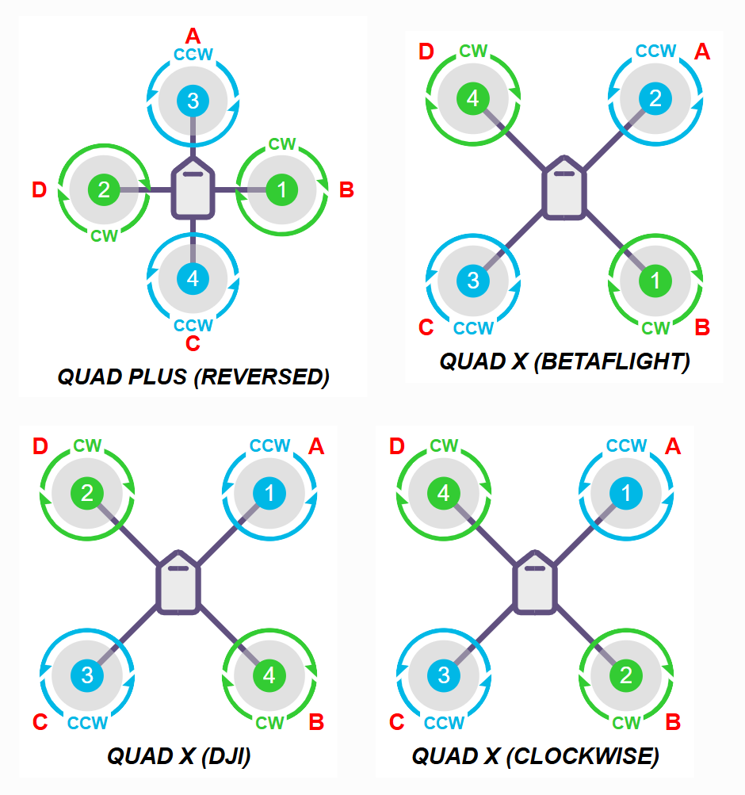
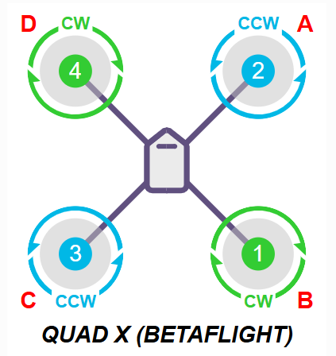
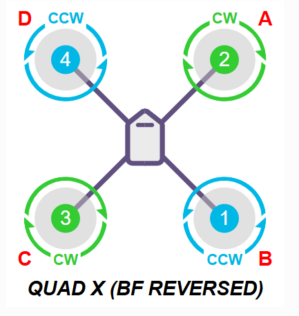
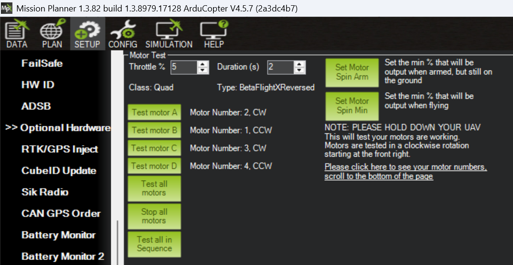

# How to Set Up Motor Order #

One of the difficulties in configuring Ardupilot is setting the order and rotation direction of the motors. Here are my notes on an easy method to configure this. The procedure below is adapted from [tutorial in Ardupilot forum](https://discuss.ardupilot.org/t/my-method-for-iteratively-configuring-motor-ordering-and-direction/67644). I add case study and real configuration value to add clarity.

To determine the motor order, we first need to tell Ardupilot about our drone configuration. For a quadcopter (4 arms, each with 1 motor) that we commonly use in Betaflight, there are several frame types that look the same but have different motor orders, such as `Quad X`, `Quad X Dji`, `Quad X Clockwise`, and `Quad X Betaflight`. 



There are also frame types with the same motor order but different rotation directions, for example, `Quad X Betaflight` and `Quad X Betaflight Reversed`.




We must be meticulous in noticing:

1. Letters A, B, C, D indicating motor positions
2. Numbers 1, 2, 3, 4 indicating motor numbering
3. Propeller rotation direction, CW means clockwise, CCW means counterclockwise

You are free to choose any frame type, as long as you remember the letters, numbers, and directions. These must later be matched with the wiring between the FC, ESC, and motors. Full frame type selection can be perused in [the official documentation](https://ardupilot.org/copter/docs/connect-escs-and-motors.html#motor-order-diagrams).

## Setting Frame Type ##

I usually use the prop-out rotation direction, so I choose the frame type `Quad X BetaFlight Reversed`. By looking at the frame image of the selected frame type, we can determine how Ardupilot assigns numbers and positions to each motor.

Quad Frame Type: `QuadX BetaFlight Reversed`

* A (Front Right): Motor 2
* B (Rear Right): Motor 1 
* C (Rear Left): Motor 3
* D (Front Left): Motor 4


The frame type is set by the `FRAME_TYPE` parameter with a value of `18` for `BetaFlightXReversed`.

## Motor Test ##

At this point, your configuration might be correct or incorrect. If it is already correct (positions ABCD match the spinning motors), congratulations, you're done. You can continue checking motor direction, the instruction can be found below. If not, we'll proceed to fix it now.

**For the following steps, MAKE SURE PROPELLERS ARE NOT INSTALLED!!!**

Plug in the battery. If your quad uses VTX, it's better not to connect it to the FC yet, to avoid overheating.

**Once again, MAKE SURE PROPELLERS ARE NOT INSTALLED!!!**

Open the Motor Test menu in `Setup > Optional Hardware > Motor Test`

**Don't forget, MAKE SURE PROPELLERS ARE NOT INSTALLED!!!**



Click the `Test Motor A`, `Test Motor B`, `Test Motor C`, `Test Motor D` buttons in sequence. Then record the results.

Here are my motor test results:

| Button Pressed       | Spinning Motor   |
|----------------------|------------------|
| A                    | rear left        |
| B                    | front left       |
| C                    | front right      |
| D                    | rear right       |

Now, these results do not match what is expected for the `Betaflight X Reversed` frame configuration we chose earlier. No problem. We will fix this.

Ardupilot instructs the FC -> ESC to spin the motors according to documentation. This means, when we click `Test Motor A`, it will command `Motor 2`, which should be at the front right (A) to spin. But based on the test, the rear left motor spins. We need to map which motor is spinning for each button.

To make it clearer, let's display the motor positions for the `Betaflight X Reversed` frame according to the Ardupilot documentation above, as follows:


| Motor Number | Motor Position    |
|--------------|------------------|
| 1            | rear right       |
| 2            | front right      |
| 3            | rear left        |
| 4            | front left       |

Now, fill in the motor numbers according to the spinning motors, like this:

| Button Pressed | Spinning Motor | Motor Number (docs) |
|----------------|----------------|---------------------|
| A              | rear left      | Motor 3             |
| B              | front left     | Motor 4             |
| C              | front right    | Motor 2             |
| D              | rear right     | Motor 1             |

Next, let's open our current servo configuration. We'll see the pairing of servo numbers and motor numbers.

Open the `Setup > Mandatory Hardware > Servo Output` tab. The current configuration is:

* Servo 1 : Motor 1
* Servo 2 : Motor 2
* Servo 3 : Motor 3
* Servo 4 : Motor 4


We fill in the servo numbers according to the spinning motor numbers:

| Button Pressed | Spinning Motor | Motor Number (docs) | Servo Number (parameter) |
|----------------|----------------|---------------------|--------------------------|
| A              | rear left      | Motor 3             | Servo 3                  |
| B              | front left     | Motor 4             | Servo 4                  |
| C              | front right    | Motor 2             | Servo 2                  |
| D              | rear right     | Motor 1             | Servo 1                  |

The correct motor order, according to the frame type, should be:

* A (Front Right): Motor 2
* B (Rear Right): Motor 1 
* C (Rear Left): Motor 3
* D (Front Left): Motor 4


Now let's add one more column: the motor number that should be spinning (according to the frame type):

| Button Pressed | Spinning Motor | Motor Number (docs) | Servo Number (parameter) | Motor Number That Should Spin |
|----------------|----------------|---------------------|--------------------------|-------------------------------|
| A              | rear left      | Motor 3             | Servo 3                  | Motor 2                       |
| B              | front left     | Motor 4             | Servo 4                  | Motor 1                       |
| C              | front right    | Motor 2             | Servo 2                  | Motor 3                       |
| D              | rear right     | Motor 1             | Servo 1                  | Motor 4                       |

From the table above, we can fix our configuration as follows (sorted by servo number):

* Servo 1 : Motor 4
* Servo 2 : Motor 3
* Servo 3 : Motor 2
* Servo 4 : Motor 1


Try testing again in the `Motor Test` tab. The motor order should now be correct.

# How to Set Up Motor Rotation Direction #

Check the motor rotation direction in the `Motor Test` tab, in the menu `Setup > Optional Hardware > Motor Test`. If the direction does not match what is required for the `Frame Type`, there are three ways to change the direction (choose one):

1. Swap the ESC-to-motor wires. There are 3 motor wires, swap any two of them. Any pair is fine.
2. Use an ESC configurator app, such as [ESC Configurator](https://esc-configurator.com/) for ESCs with BLHeli_S, BlueJay, or AM32 firmware. Or [BLHeliSuite32](https://github.com/blheli-configurator/blheli-configurator) for BLHeli_32 firmware.
3. Use Mission Planner/QGroundControl.

We will use method `3` so we don’t have to bother with soldering or installing other applications.

Go to the menu `Config > Full Parameter List`, then open the parameter `SERVO_BLH_RVMASK`. Edit the bitmask, check the `Channel` that matches the motor number you want to reverse its direction. In the screenshot example, motor 1, 3, and 4 are checked, which means their direction will be reversed.

.
```