# Setting Ardupilot #

Spesifikasi : 

* FC : SpeedyBee F405 V4 
* ESC : SpeedyBee BLS 55A - using DShot300
* Radio Receiver : Matek RP4TD
* GPS : MicoAir M10G-5883
* Motor : Emax Eco II 1750KV

Dokumentasi FC ESC

* [Product Website](https://www.speedybee.com/speedybee-f405-v4-bls-55a-30x30-fc-esc-stack/)
* [User Manual](https://store-fhxxhuiq8q.mybigcommerce.com/product_images/img_SpeedyBee_F405_V4_Stack/SpeedyBee_F405_V4_Stack_Manual_EN.pdf)
* [Website Ardupilot](https://ardupilot.org/copter/docs/common-speedybeef4-v3.html)

## Mission Planner Settings ##

1. Set Frame Type

    * Jumlah Motor : 4
    * Type : Quad X Reversed

    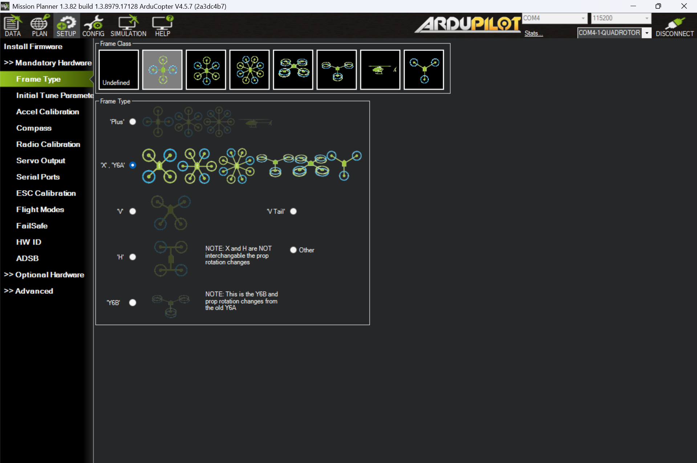

2. Initial Tune

    * Batre : 6s
    * Max Voltage : 4.2 volt
    * Min Voltage : 3.3 volt

    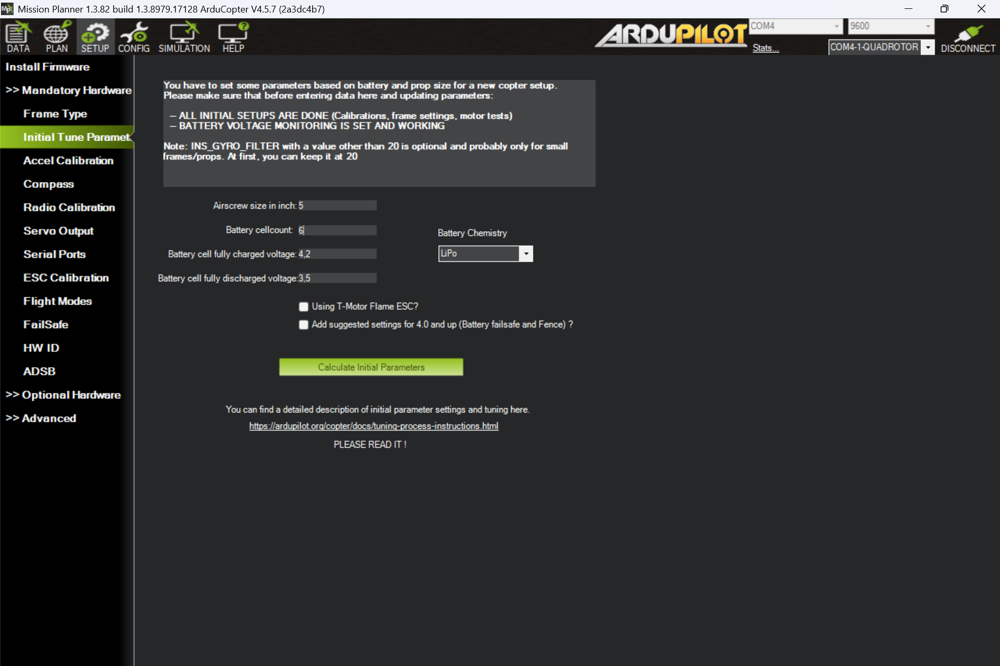

3. Urutan motor (pemasangan ESC dibalik: depan ke belakang) untuk prop-out (arah putaran propeller ke luar).
   
   * Servo 1 : Motor 4
   * Servo 2 : Motor 3
   * Servo 3 : Motor 2
   * Servo 4 : Motor 1

   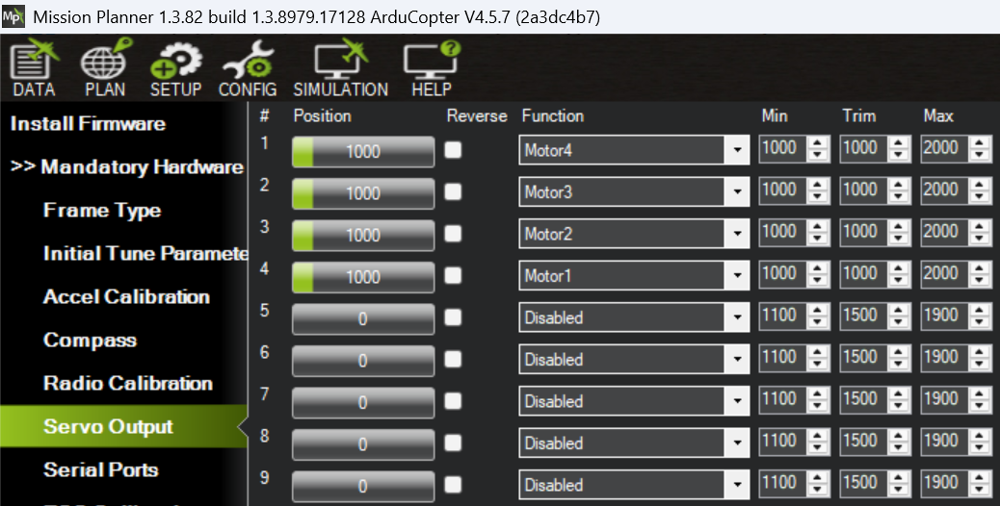

   Cara settingnya dijelaskan di [dokumen terpisah](./cara-setup-urutan-motor.md)

4. Set Serial Port

    * UART1 : 115200 - DisplayPort
    * UART2 : 460800 - MavLink2
    * UART5 : 115200 - ESC Telemetry
    * UART6 : 115200 - GPS

    

5. Jenis ESC

    * ESC Type : DShot300
    * Firmware : Bluejay
    * Version : 0.21.0

    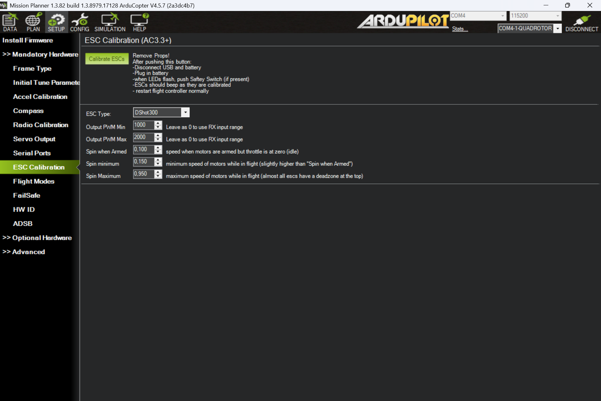

6. Set Flight Modes

    * 1 : Stabilize
    * 2 : Acro
    * 3 : Loiter
    * 4 : Auto / Mission
    * 5 : Guided
    * 6 : Return to Launch

    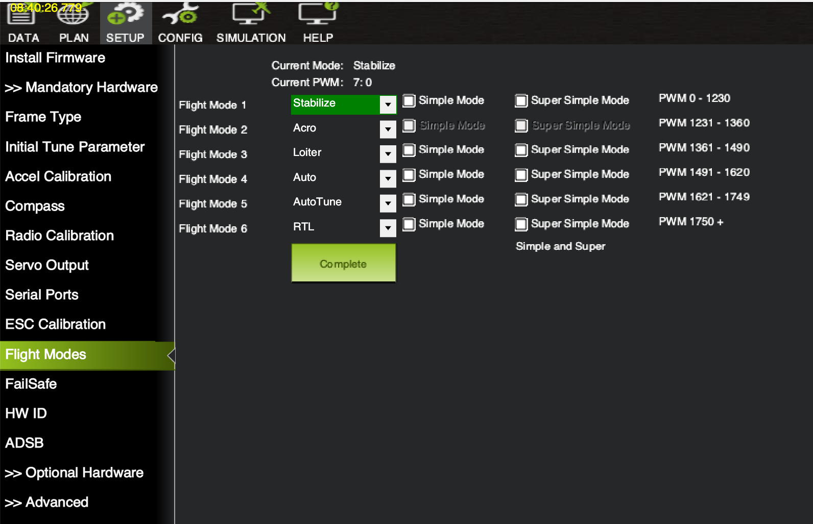

7. Set Flight Mode Channel (Channel 7)

    * FLTMODE_CH = 7

8. Set Arming Channel (Channel 5 / AUX 1)

    * RC5_OPTION : 154

9. Set Autotune Channel di Channel 6

    * RC6_OPTION : 17


10. Motor Test (untuk memastikan urutan dan arah putaran motor)

    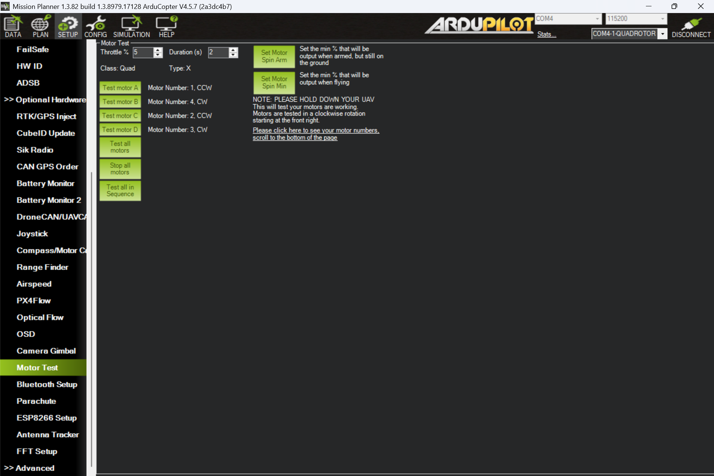

    Urutan dan arah putaran bisa dilihat [di dokumentasi Ardupilot](https://ardupilot.org/copter/docs/connect-escs-and-motors.html)

12. MavLink via ELRS Backpack
   
    * RSSI_TYPE = 5
    * [Referensi Website Resmi](https://www.expresslrs.org/software/mavlink/)

    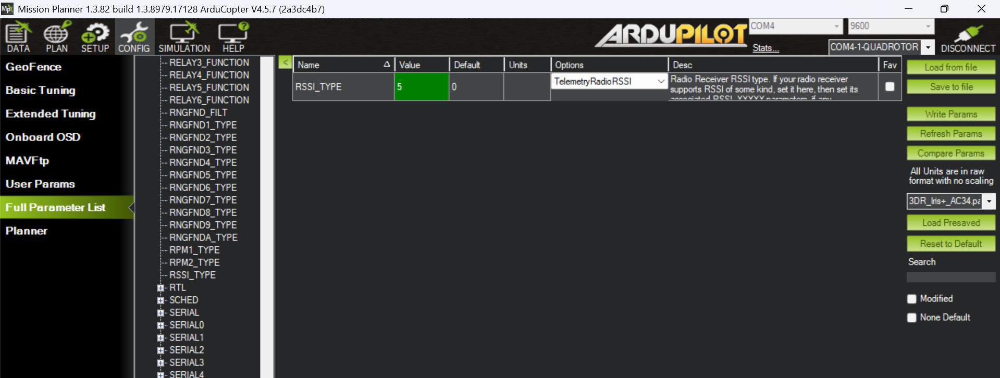

13. Connect laptop ke backpack remote via wifi. Mission Planner pilih protokol UDP

    * [Tutorial Om Tony](https://www.youtube.com/watch?v=EOUdSb7iJ2s)

    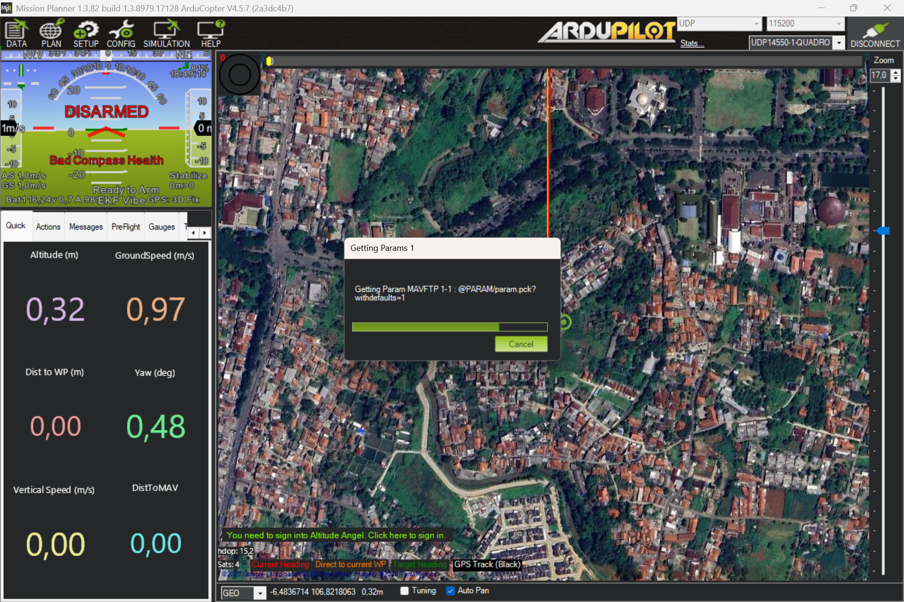

14. Setup Walksnail OSD

    * OSD_TYPE = 5 (MSP_DISPLAYPORT)
    * OSD_CELL_COUNT = 4
    * MSP_OPTIONS = 0
    * SERIAL1_PROTOCOL = 42 (DisplayPort)
    * SERIAL1_BAUD = 115

MSP_OPTIONS set bit 0 = 0 (do NOT EnableTelemetryMode)

13. Setting Battery Failsafe ke Land

    * BATT_FS_CRT_ACT = 1
    * BATT_FS_LOW_ACT = 1

14. Tambahkan radio failsafe timeout supaya bisa arming

    * RC_FS_TIMEOUT = 2

15. Disable Acro Trainer

    * ACRO_TRAINER - 0

16. Initial Tuning Parameter (untuk 5 inch 6s)

```
ANGLE_MAX,6000
ARMING_CHECK,1
ATC_ACCEL_P_MAX,162000
ATC_ACCEL_R_MAX,162000
ATC_ACCEL_Y_MAX,56000
ATC_ANG_PIT_P,12
ATC_ANG_RLL_P,12
ATC_ANG_YAW_P,6
ATC_RAT_PIT_D,0.001
ATC_RAT_PIT_I,0.06
ATC_RAT_PIT_P,0.06
ATC_RAT_PIT_SMAX,0
ATC_RAT_RLL_D,0.001
ATC_RAT_RLL_I,0.06
ATC_RAT_RLL_P,0.06
ATC_RAT_RLL_SMAX,0
ATC_RAT_YAW_D,0.002
ATC_RAT_YAW_I,0.02
ATC_RAT_YAW_P,0.2
ATC_RAT_YAW_SMAX,0
BATT_ARM_VOLT,22.10
BATT_CRT_VOLT,21.00
BATT_LOW_VOLT,21.60
GPS1_GNSS_MODE,5
INS_HNTCH_BW,30
INS_HNTCH_FREQ,140
INS_HNTCH_HMNCS,1
INS_HNTCH_OPTS,6
INS_LOG_BAT_OPT,4
LOG_BITMASK,180222
MOT_BAT_VOLT_MIN,19.80
PSC_ACCZ_I,0.26
PSC_ACCZ_P,0.13
PSC_VELZ_P,3
SERVO_BLH_AUTO,1
SERVO_DSHOT_ESC,2
```

17. Setelah hover stabil di mode `Stabilize`, `Altitude Hold`, dan `Loiter` bisa lanjut ke `Autotune`

```
AUTOTUNE_AGGR,0.1
AUTOTUNE_AXES,3
```

    Lakukan `autotune` bergantian per axis. Supaya baterainya cukup.

## Connection Diagram ##

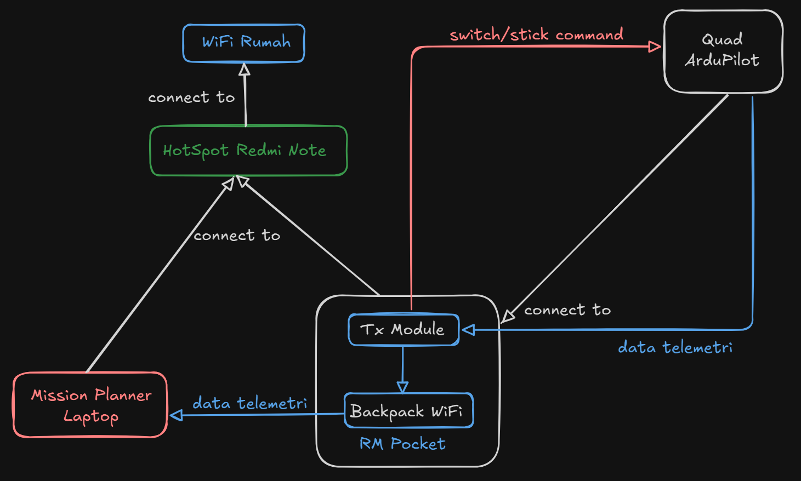

## Remote Control Settings ##

1. Remote : Radiomaster Pocket ELRS

    * Internal TX Firmware : 3.5.4
    * Backpack Firmware : 1.5.2

2. Switch Mapping : 

    * Switch A - 2 pos - Channel 5 : Arming
    * Switch B - 3 pos - Channel 7 : Flight Mode 1
    * Switch D - 2 pos - Channel 7 : Flight Mode 2

3. Mixer Settings

    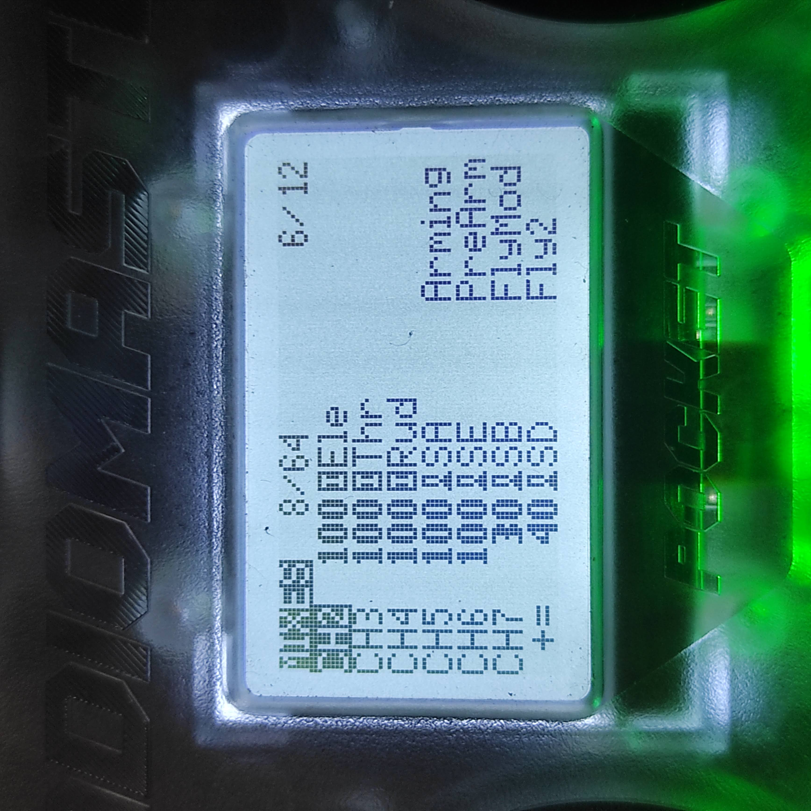
    
    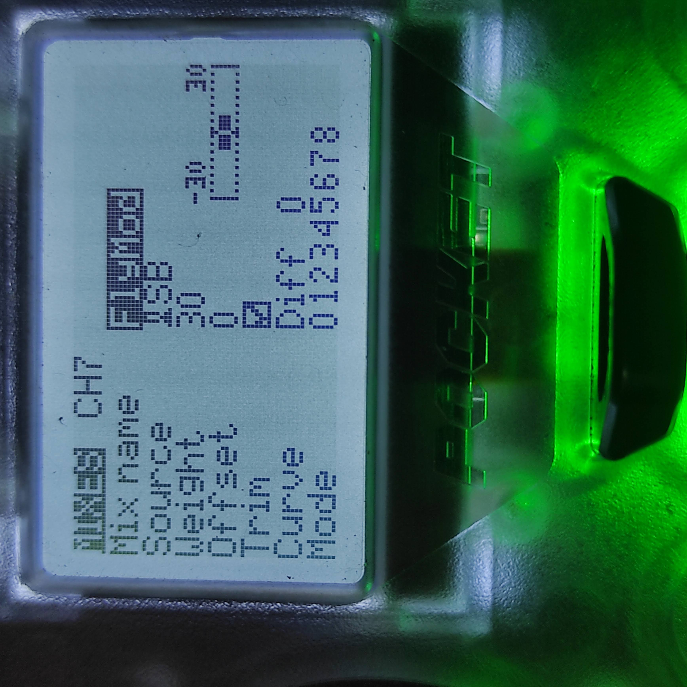
    
    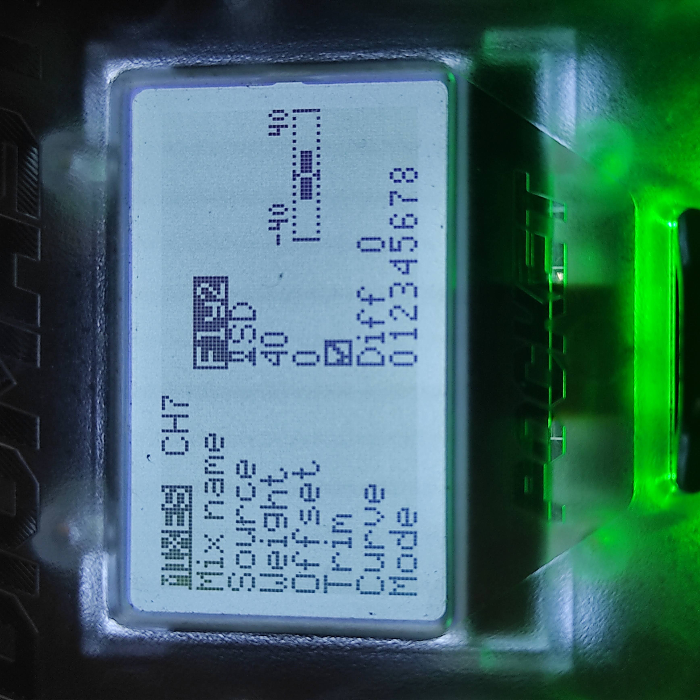

4. ExpressLRS Lua Settings

    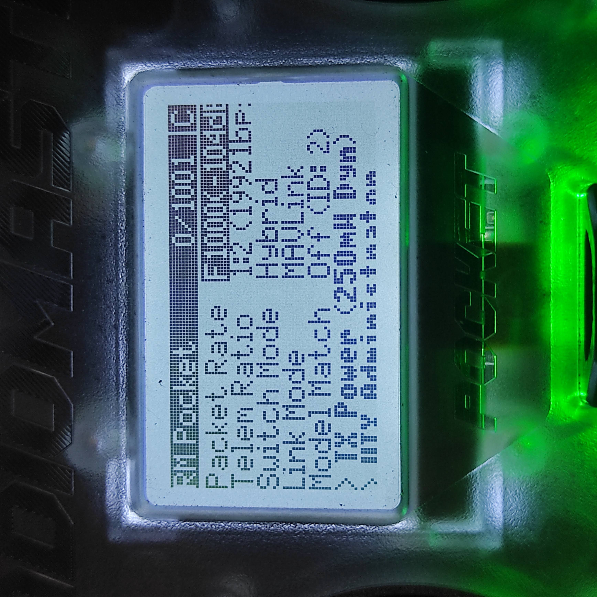
    
    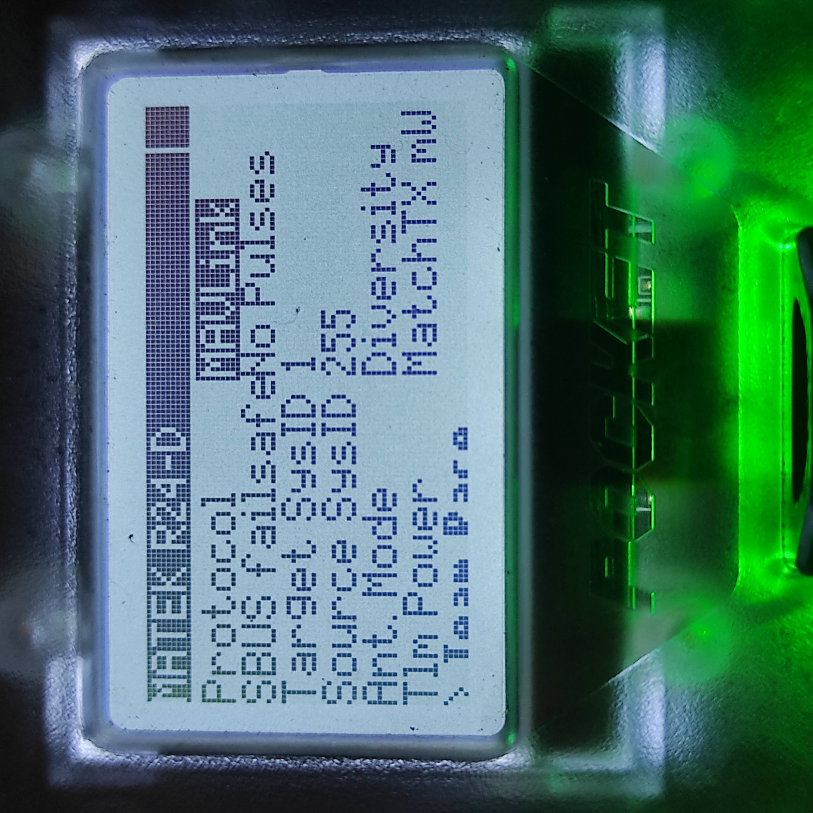
    
    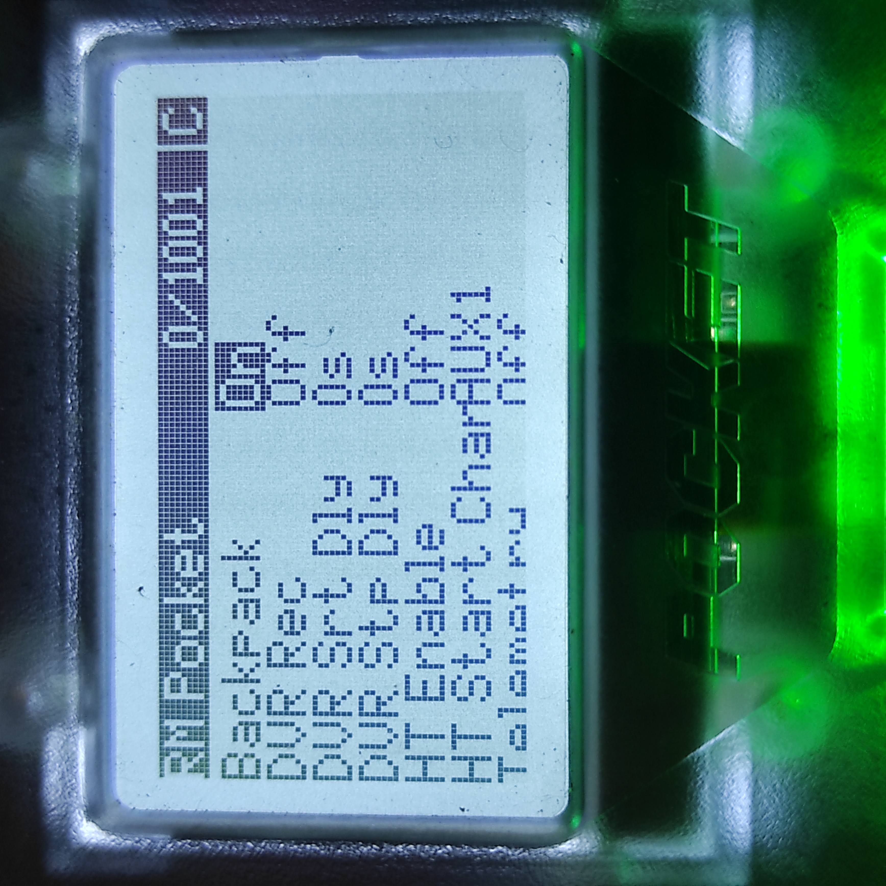

    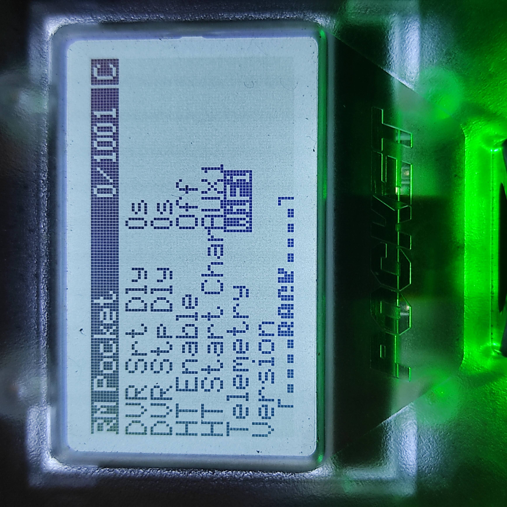
