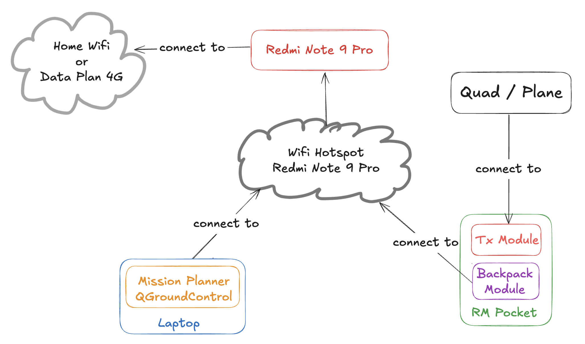

# Setting Ardupilot #

Spesifikasi : 

* FC : SpeedyBee F405 V4 
* ESC : SpeedyBee BLS 55A
* Radio Receiver : Matek RP4TD
* GPS : HGLRC M10

Dokumentasi FC ESC

* [Product Website](https://www.speedybee.com/speedybee-f405-v4-bls-55a-30x30-fc-esc-stack/)
* [User Manual](https://store-fhxxhuiq8q.mybigcommerce.com/product_images/img_SpeedyBee_F405_V4_Stack/SpeedyBee_F405_V4_Stack_Manual_EN.pdf)
* [Website Ardupilot](https://ardupilot.org/copter/docs/common-speedybeef4-v3.html)

## Settings ##

1. Set Frame Type

    * Jumlah Motor : 4
    * Type : X

    

2. Initial Tune

    * Batre : 6s
    * Max Voltage : 4.2 volt
    * Min Voltage : 3.5 volt

    

3. Urutan motor (pemasangan ESC dibalik: depan ke belakang)
   
   * Servo 1 : Motor 3
   * Servo 2 : Motor 2
   * Servo 3 : Motor 1
   * Servo 4 : Motor 4

   

4. Set Serial Port

    * UART1 : 115200 - DisplayPort
    * UART2 : 460800 - MavLink2
    * UART5 : 115200 - ESC Telemetry
    * UART6 : 115200 - GPS

    

5. Jenis ESC

    * ESC Type : DShot300
    * Firmware : Bluejay
    * Version : 0.21.0

    

6. Set Flight Modes

    * 1 : Stabilize
    * 2 : Acro
    * 3 : Return To Launch
    * 4 : Position Hold
    * 5 : Auto (Mission) / AutoTune
    * 6 : Loiter

    

7. Set Flight Mode Channel (Channel 7)

    * FLTMODE_CH = 7

8. Set Arming Channel (Channel 5 / AUX 1)

    * RC5_OPTION : 5

9. Motor Test (untuk memastikan urutan dan arah putaran motor)

    

    Urutan dan arah putaran bisa dilihat [di dokumentasi Ardupilot](https://ardupilot.org/copter/docs/connect-escs-and-motors.html)

10. MavLink via ELRS Backpack
   
    * RSSI_TYPE = 5
    * [Referensi Website Resmi](https://www.expresslrs.org/software/mavlink/)

    

11. Connect laptop ke backpack remote via wifi. Mission Planner pilih protokol UDP

    * [Tutorial Om Tony](https://www.youtube.com/watch?v=EOUdSb7iJ2s)

    

12. Setup Walksnail OSD

    * OSD_TYPE = 5 (MSP_DISPLAYPORT)
    * OSD_CELL_COUNT = 4
    * MSP_OPTIONS = 0
    * SERIAL1_PROTOCOL = 42 (DisplayPort)
    * SERIAL1_BAUD = 115

MSP_OPTIONS set bit 0 = 0 (do NOT EnableTelemetryMode)

## Connection Diagram ##

